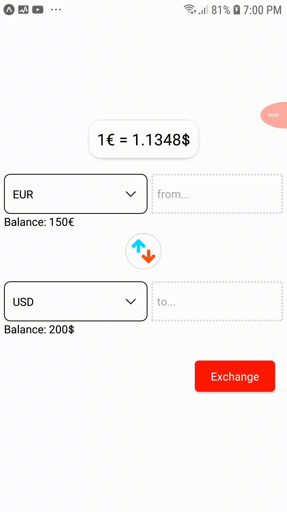

# FE-Test App Initialized with EXPO

to run the app just do

`yarn && yarn android`

make sure you have `expo-cli` installed first.

test files can be found at '/tests' and '/src/screens/main-screen' folder

#Demo

